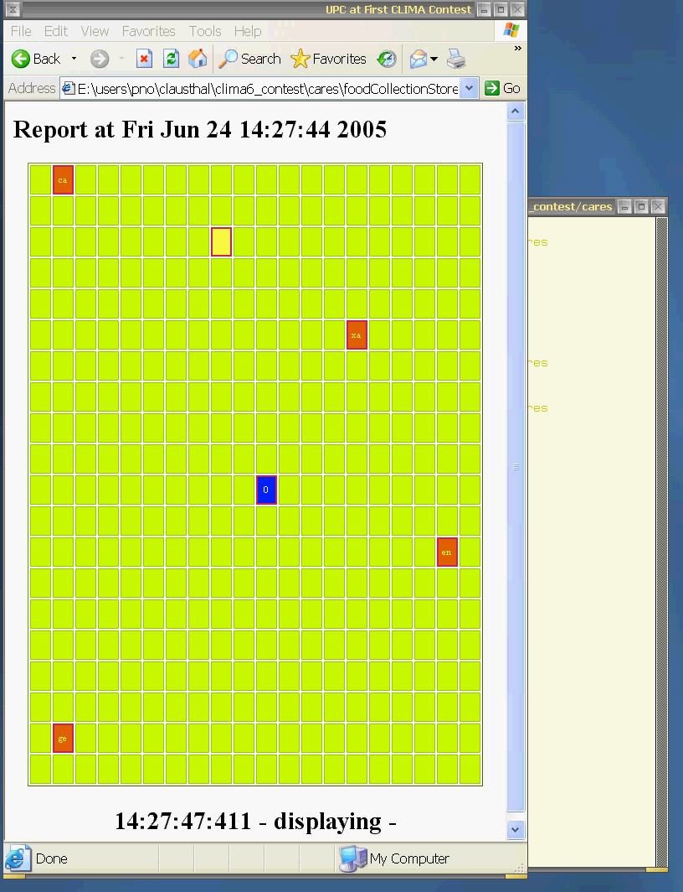
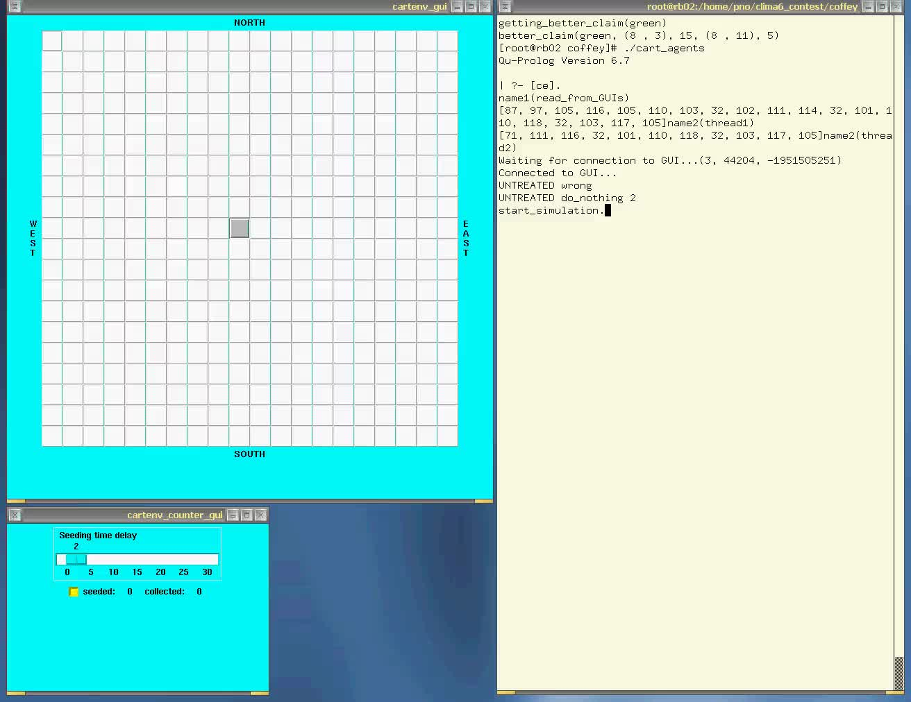
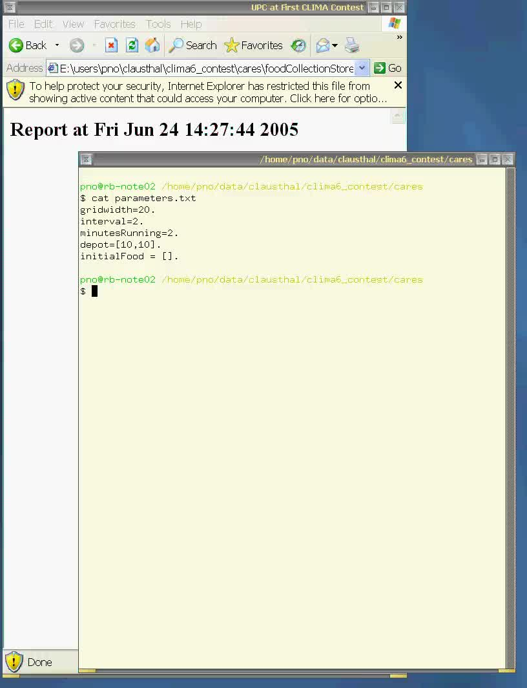

Overview
--------

This was the first agent contest, called the
[CLIMA VI Contest](http://clima.deis.unibo.it/contest.html), organized within
the [CLIMA VI workshop](http://clima.deis.unibo.it/), **June 27-29, 2005**
at the City University London, UK ([report](http://www.springerlink.com/content/x94625u38l406k7h/)).

* Submission: May 20, 2005
* Notification: May 27, 2005
* Camera-Ready: June 6, 2005
* Winner announcement: at CLIMA, June 27-29, 2005

Winners
-------

* **Simon Coffey and Dorian Gaertner**, from Imperial College London, UK
* **Carlos Cares, Xavier Franch and Enric Mayol**,
  from Universitat Politècnica de Catalunya, Barcelona, Spain,
  and Universidad de la Frontera, Temuco, Chile

Organizers
----------

This contest was organized by

* [Mehdi Dastani](http://www.uu.nl/medewerkers/MMDastani), Utrecht University, and
* [Jürgen Dix](http://www.in.tu-clausthal.de/divisions/cig/cigroot/members/leader/cigmember-dix/), Technical University of Clausthal.

Aim and Scope
-------------

Multi-agent systems are beginning to play an important role in today's
software development. See for example the forthcoming new [International Journal of Agent-Oriented Software Engineering](http://www.inderscience.com/browse/index.php?journalID=174).

This competition is an attempt to stimulate research in the area of multi-agent systems by

* identifying key problems and
* collecting suitable benchmarks

that can serve as milestones for testing new approaches and techniques from computational logics. While there exist several competitions in various parts of artificial intelligence (theorem proving, planning, robo-cup etc) and, lately, also in specialised areas in agent systems (trading agents), the emphasis of this contest is on the use of 'computational logic' in (multi-) agent systems.

We expect to promote the development of multi-agent systems by first identifying difficult problems and then finding solutions by comparing different approaches from computational logic for solving them. While this idea seems very appealing, it is not an easy task to come up with a particular scenario that serves as a basis for a contest. Such a scenario should be generic enough to be applicable for a wide range of techniques of computational logic, but it should also be precise enough so that different approaches can be tested and compared against each other.

Scenario Description
--------------------

This competition is organised as part of CLIMA and consists of developing multi-agent systems to solve a cooperative task in a dynamically changing environment. The environment of the multi-agent system is a grid-like world where agents can move from one slot to a neighbouring slot if there is no agent already in that slot. In this environment, food can appear in all but one of these slots. The special slot, in which no food can appear, is considered as a depot where the agents can bring and collect their food. An agent can observe if there is food in the slot it is currently visiting. Initially, food can be placed in some randomly selected slots. During the execution, additional food can appear dynamically in randomly selected slots except the depot slot. The agents may have/play different roles (such as explorer or collector), communicate and cooperate in order to find and collect food in an efficient and effective way.

We encourage submissions that specify and design a multi-agent system in terms of high-level concepts such as goals, beliefs, plans, roles, communication, coordination, negotiation, and dialogue in order to generate an efficient and effective solution for the above mentioned application. Moreover, the multi-agent system implementations should be based on computational logic techniques (e.g. logic programming, formal calculi, etc) and they should reflect their design in a direct and intuitive way.

The challenge of this competition is thus to use computational logic techniques to provide implemented models for the abstract concepts that are used in the specification and design of multi-agent systems. These implemented models should be integrated to implement the above-mentioned application intuitively, directly, and effectively.

Submission Format
-----------------

A submission consists of two parts.

**The first part is a description** of analysis, design and implementation of a multi-agent system for the above application. Existing multi-agent system methodologies such as Gaia, Prometheus and Tropos can be used (not demanded) to describe the analysis and design of the system. For the description of the implementation, it should be explained how the design is implemented. This can be done by explaining, for example, which computational logic techniques are used to implement certain aspects of the multi-agent system (including issues related to individual agents). The maximum length of this description is 5 pages according to the LNCS format.

**The second part is an (executable) implementation** of the application. We do not demand any particular way (data format, algorithm, mechanism) to implement the system as long as it is implemented as a multi-agent system and as long as the environment is a 20x20 grid. Moreover, it should be possible to configure the initial state of the environment to place food in arbitrary slots. During the execution food should appear automatically every 20 seconds in a randomly selected slot. The multi-agent system will be run with 4 agents that are positioned initially at the corners of the grid. The implementation should be executable on a windows or linux machine.

Winning Criteria
----------------

The criteria that will be used to evaluate submission and to select the first three winners are as follows:

1. **Original, innovative, and effective application of computational logic techniques** in solving specific multi-agent issues identified in this application.
2. The **performance of the executable implementation**. The performance of the executable implementation will be measured based on the amount of food that is collected by the multi-agent system in a certain period of time. All programs will be run on the same machine (Windows/Linux double boot machine).
3. The **quality of the description** of analysis, design and implementation of the multi-agent system, the **elegance of its design and implementation**, and the **ease of installation and execution** of the program.

Evaluation Committee
--------------------

* **Marco Alberti**, University of Ferrara, Italy
* **Federico Chesani**, University of Bologna, Italy
* **Mehdi Dastani**, Utrecht University, The Netherlands (chair)
* **Jürgen Dix**, Technical University of Clausthal, Germany (chair)
* **Marco Gavanelli**, University of Ferrara, Italy
* **Peter Novak**, Technical University of Clausthal, Germany
* **Kostas Stathis**, City University London, UK
* **Francesca Toni**, Imperial College London, UK
* **Paolo Torroni**, University of Bologna, Italy

Winners
-------

The winners of the the First CLIMA Contest are, ex-aequo,

### Simon Coffey and Dorian Gaertner

from Imperial College London, UK

<video controls>
  <source src="coffey.mp4" type="video/mp4">
  <source src="coffey.webm" type="video/webm">
  
</video>

#### Submitted materials

Qu-Prolog distribution, ICM library distribution, installation instructions, implementation in Qu-Prolog

#### Simulation

* initially no food on the grid
* depot (randomly placed) at: [10,10]
* interval of food seeding: 5 sec.
* amount of food seeded at one seeding: 2-5 (subjective estimate!)
* overall simulation time: approx. 3min 30 sec.
* total amount of food seeded: 47
* total amount of food collected to the depot: 15
* total number of simulation cycles: not known
* 4 agents are moving on the grid, but one is pure explorer and never collects the food
* when the piece of food is found either by an explorer, or an agent already carrying the food, this food position is marked and communicated to other agents
* when a collector finds a piece of food, it loads it (changes it's shape)
* initially agents are not informed about the depot position, but once it is found all of them know where it is
* agents do a random search of the grid, but once the depot is found and piece of food is collected, it goes directly to the depot to store it.
* after unloading the food in the depot, an agent decides on which piece of food it should collect next (from those which are marked as found) and then foes for it
* of in the course of going to pick up a piece of food (via the shortest path) other piece of food is found, the current claim is dropped and the new piece is picked up.
* seems like agents are sometimes negotiating on which piece of food which agent collects - sometimes the current claim of an agent A is dropped in favor of an agent B which is closer (overall price of food collecting is lower)

#### Visualization

* two windows appear, one is the simulation environment and in the other user can set the food seeding interval and see agents logged into the system
* four agents (colored boxes) are randomly run around a white grid looking for yellow food and gray depot.
* when an agents has a food loaded, it has a shape of two overlapping squares
* when an agent is heading for a piece of food, colored line is drawn from its actual position to the claimed piece of food
* during the negotitation agents can cancel their claims on pieces of food, so the line is removed
* agents sometimes perform kind of complicated "dances" ;-) in order to avoid each other

### Carlos Cares, Xavier Franch and Enric Mayol

from Universitat Politècnica de Catalunya, Barcelona, Spain, and Universidad de la Frontera, Temuco, Chile

<video controls>
  <source src="cares.mp4" type="video/mp4">
  <source src="cares.webm" type="video/webm">
  
</video>

#### Submitted materials

Windows executable, which runs the simulation and creates an HTML file which can be visualized by a web browser.

#### Configuration options

* grid size,
* interval of food seeding,
* length of the simulation (in minutes - fractions allowed),
* position of the depot,
* initial configuration of food

#### Simulation

* the depot at [10,10]
* initially no food on the grid
* interval of food seeding: 5 sec.
* amount of food seeded at one seeding: 1
* overall simulation time: 3 min.
* approx. steps per second: 1-9
* total amount of food collected to the depot: 25
* total number of simulation cycles: 1066- number of agents involved in the simulation is 5
* agents' roles:
  1. ca: explorer. teamMember, ruleGuard
  2. xa: collector, teamMember, ruleGuard
  3. en: collector, teamMember, ruleGuard
  4. ge: collector, teamMember, ruleGuard
  5. fp: foodProvider
* obviously they have 4 collector agents and the 5th is there just the food seeder
* agents are searching the grid in a non-random fashion (exploring the grid either row by row, or column by column)
* agent ca is systematically exploring the grid column by column, but never collects the food
* others seem to do it row by row, but sometimes change their behaviour
* when an agent find a food, it goes and stores it in the depot and after that it returns to the place where it's search for food finished and continous to search again

#### Visualization

* at first you have to run the whole simulation and then later you can visualize it in the web browser using JavaScript powered HTML file.
* visualization shows 4 collector agents as red boxes with their names on them running around the green grid and collecting the yellow food. The amount of collected food is shown as a caption on the blue depot slot.
