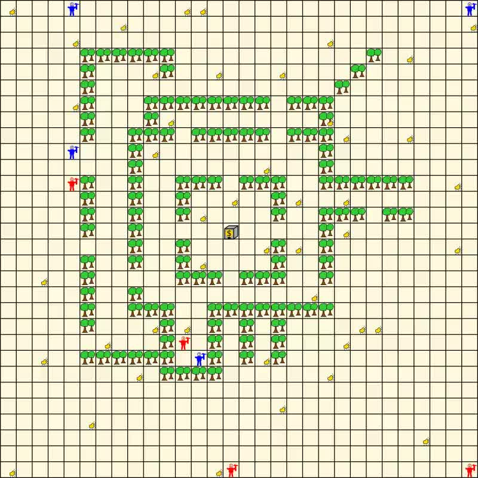

Overview
--------

This contest was organzied as part of the **CLIMA VII workshop** collocated with **AAMAS'06** conference in Hakodate, Japan.

* **Submission of the description:** February 10, 2006
* **Author notification:** February 24, 2006
* **Camera-Ready of the description:** March 10, 2006
* **Competition:** 27.04.2006 at 15:00
* **Winner announcement:** 08.05.2006, Hakodate, Japan

Winners
-------

The winner of the tournament was team brazil by Rafael Bordini and Jomi Huebner.

<video controls>
  <source src="GridSimulation_spainbrazil_labyrinth_2006-04-27_20-10.mp4" type="video/mp4">
  <source src="GridSimulation_spainbrazil_labyrinth_2006-04-27_20-10.webm" type="video/webm">
  
</video>

(Team spain vs. Team brazil)

Organizers
----------

* [Mehdi Dastani](http://www.cs.uu.nl/~mehdi/),
  [Utrecht University](http://www.uu.nl/),
* [Jürgen Dix](http://www.in.tu-clausthal.de/divisions/cig/cigroot/members/leader/cigmember-dix/),
  [Clausthal University of Technology](http://www.tu-clausthal.de/), and
* [Peter Novak](http://peter.aronde.net/), [Clausthal University of Technology](http://www.tu-clausthal.de/).

Aims and Scope
--------------

Aims and Scope

Multi-agent systems are beginning to play an important role in today's software development. See for example the forthcoming new International Journal of Agent-Oriented Software Engineering.

This competition is an attempt to stimulate research in the area of multi-agent systems by

* identifying key problems and
* collecting suitable benchmarks

that can serve as milestones for testing new approaches and techniques from computational logics. While there exist several competitions in various parts of artificial intelligence (theorem proving, planning, robo-cup etc) and, lately, also in specialised areas in agent systems (trading agents), the emphasis of this contest is on the use of 'computational logic' in (multi-) agent systems.

We expect to promote the development of multi-agent systems by first identifying difficult problems and then finding solutions by comparing different approaches from computational logic for solving them. While this idea seems very appealing, it is not an easy task to come up with a particular scenario that serves as a basis for a contest. Such a scenario should be generic enough to be applicable for a wide range of techniques of computational logic, but it should also be precise enough so that different approaches can be tested and compared against each other.

Call for Submissions
--------------------

We encourage submissions that specify and design a multi-agent system in terms of high-level concepts such as goals, beliefs, plans, roles, communication, coordination, negotiation, and dialogue in order to generate an efficient and effective solution for the above mentioned application. Moreover, the use of computational logic techniques (e.g., logic programming, formal calculi, etc.)in the implementations of multi-agent system is appreciated. A challenge of this competition is to use computational logic techniques to provide implemented models for the abstract concepts that are used in the specification and design of multi-agent systems. These implemented models should be integrated to implement the above-mentioned application intuitively, directly, and effectively.

All the details can be found in the call for submissions.

Scenario Description
--------------------

Recently, rumours about the discovery of gold scattered around deep Carpathian woods made their way into the public. Consequently hordes of gold miners are pouring into the area in the hope to collect as much of gold nuggets as possible. Two small teams of gold miners find themselves exploring the same area, avoiding trees and bushes and competing for the gold nuggets spread around the woods. The gold miners of each team coordinate their actions in order to collect as much gold as they can and to deliver it to the trading agent located in a depot where the gold is safely stored.

Submission Format
-----------------

A submission consists of two parts.

The first part is a description of analysis, design and implementation of a multi-agent system for the above application. Existing multi-agent system methodologies such as Gaia, Prometheus and Tropos can be used (not demanded) to describe the analysis and design of the system. For the description of the implementation, it should be explained how the design is implemented. This can be done by explaining, for example, which computational logic techniques are used to implement certain aspects of the multi-agent system (including issues related to individual agents). The maximum length of this description is 5 pages according to the LNCS format.

The second part is an implementation of the application. The agents from each participating team will be executed locally (on the participant's hardware) while the simulated environment, in which all agents from competing teams perform actions, is run on the remote contest simulation server. The interaction/communication between agents from one team should be managed locally, but the interaction between individual agents and their environment (run on the simulation server) will be via Internet. Participating agents connect to the simulation server that provides the information about the environment. Each agent from each team should connect and communicate to the simulation server using one TCP connection.

For more details see the scenario description and the communication protocol description.

How to Submit
-------------

Please submit a 5 page description of your solution to Mehdi Dastani ([mehdi@cs.uu.nl](mailto:mehdi@cs.uu.nl)) till February 10, 2006. Several days before the start of the competition, the contest organisers will contact participants via e-mail with details on time and Internet coordinates (IP addresses/ports) of the simulation server.

Downloads
---------

* [svgvideos.tar.xz](svgvideos.tar.xz) (50 MB, 6 GB uncompressed)
* [c7c-CFP.txt](c7c-CFP.txt)
* [c7c-protocol.txt](c7c-protocol.txt)
* [c7c-scenario-final.txt](c7c-scenario-final.txt)
* [CLIMAVIIREADME.txt](CLIMAVIIREADME.txt)
* [massim-demoAgent-v0_2.tar.bz2](massim-demoAgent-v0_2.tar.bz2)
* [massim-serverMonitor-v0_2.tar.bz2](massim-serverMonitor-v0_2.tar.bz2)
* [massim-server-v0_3.tar.bz2](massim-server-v0_3.tar.bz2)
