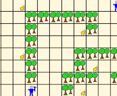

Overview
--------

In 2007, the contest was organised as part of the ProMAS workshop (a workshop organized within AAMAS 2007). It consisted of applying (or developing from scratch) a multi-agent system to solve a cooperative task in a dynamically changing environment. The environment of the multi-agent system was a grid-like world where agents can move from one cell to a neighbouring cell if there is no agent or obstacle already in that cell. In this environment, gold can appear in the cells. Participating agent teams explored the environment, avoided obstacles and competed with another agent team for the gold in the environment.

* **Submission of the description:** March 6th, 2007
* **Author notification:** March 10th, 2007
* **Camera-Ready of the description:** March 19, 2007
* **Competition:** Starting on May 2nd 2007
* **Winner announcement:** May 14/15, 2007

Technical arrangements
----------------------

* **Test suite release:** March 3rd 2007
* **On-line testing phase:** launched on March 27th 2007

Winners
-------

The JiacIV team won the 2007 tournament.

Organizers
----------

* [Mehdi Dastani](http://www.cs.uu.nl/~mehdi/),
  [Utrecht University](http://www.uu.nl/),
* [Jürgen Dix](http://www.in.tu-clausthal.de/divisions/cig/cigroot/members/leader/cigmember-dix/),
  [Clausthal University of Technology](http://www.tu-clausthal.de/), and
* [Peter Novak](http://peter.aronde.net/), [Clausthal University of Technology](http://www.tu-clausthal.de/).

Aims and Scope
--------------

This competition is an attempt to stimulate research in the area of multi-agent programming by

1. identifying key problems and
2. collecting suitable benchmarks

that can serve as milestones for testing agent-oriented programming languages, platforms and tools. We also expect that participating at the contest helps to debug a system and to identify weak parts in it. The performance of a particular system will be determined in a series of games where the systems compete against each other. While winning the competition is not the main point, we hope it will shed light on the applicability of certain frameworks to particular domains.

Scenario Description
--------------------

The rumor has it that in 2006 the first expeditions of prospectors set out for the unexplored deep forests in inner western Carpathians and shortly after their return some of those miners became major players on the German stock exchange. This started a golden rush in the area and large teams of well equipped miners and prospectors are trying to make their way to the mountains and collect as much gold as possible.

Teams of gold miners find themselves exploring the same area, avoiding trees and bushes and competing for the gold nuggets spread around the woods. The gold miners of each team coordinate their actions in order to collect as much gold as they can and to deliver it to the trading agent located in a depot where the gold is safely stored. However, this adventure is also quite dangerous as meeting a member of a different team often results in a violence.

Fixed Scenario
--------------

On february 1st we published the contest scenario, but later there was a bug found in it. These fixes were made:

1. **a mistake about a number of gold items an agent can carry was fixed:** An agent is allowed to carry up to maximum of 3 gold items. This however has an influence on the failure probability of its actions.
2. **remark about a uniform distribution of gold items in the environment was removed:** Whether the probability distribution of generating of new gold items in the environment is uniform, or not will be decided later. We will announce and discuss this issue on the contest mailing list.
3. **distinct IP addresses requirement:** This requirement might be a subject to change in the future. The aim of it is actually to make sure that the agents are independent entities which act autonomously in the environment and do communicate using an "explicit" communication, i.e. not using e.g. shared memory, or other "implicit" method.

   In the case that some participating team will have difficulties to fulfill the requirement of one IP address per agent (due to e.g. a specialized network infrastructure like e.g. [NAT, or IP masquerading](https://en.wikipedia.org/wiki/Network_address_translation)), we are open to discuss the solution per case.

Call for Submissions
--------------------

We encourage submissions that specify and design a multi-agent system in terms of high-level concepts such as goals, beliefs, plans, roles, communication, coordination, negotiation, and dialogue in order to generate an efficient and effective solution for the above mentioned application. A challenge of this competition is to use high level agent oriented programming techniques and to provide implemented models for the abstract concepts that are used in the specification and design of multi-agent systems. These implemented models should be integrated to implement the above-mentioned application intuitively, directly, and effectively. All the details can be found in the call for submissions.

History
-------

This is the third such contest. After organizing the first two in association with [CLIMA](http://centria.di.fct.unl.pt/~clima/) conference series, the third edition is associated with [ProMAS 2007](http://www.cs.uu.nl/ProMAS/2007/) workshop.

* [CLIMA VII Contest](/2006/), with CLIMA VII/AAMAS 2006, May 8 2006, Future University, Hakodate, Japan ([report](/publications/ifi0613dastani.pdf))
* [CLIMA VI Contest](/2005/), with CLIMA VI workshop, June 27-29, 2005, City University London, UK ([report](http://www.springerlink.com/content/x94625u38l406k7h/?p=65d93f9b62724b8891b1fa698746ef95&pi=7))

Participation Requirements
--------------------------

The participation in this contest consists of two parts:

1. Submission of the description of analysis, design and implementation of a multi-agent system for the above application. Existing multi-agent system methodologies such as Gaia, Prometheus or Tropos can be used to describe the system. For the description of the implementation, it should be explained how the design is implemented. This can be done by explaining, for example, which programming language, platform, tools, and techniques are used to implement the multi-agent system. The maximum length of this description is 5 pages according to the LNCS format.
2. Participation in the contest tournament by means of an (executable) implementation of a multi-agent system. The agents from each participating systems (agent teams) will be executed locally (on the participant's hardware) while the simulated environment, in which all agents from competing teams perform actions, is run on the remote contest simulation server.

   Interaction/communication between agents from one team should be managed locally, but the interaction between individual agents and their environment (run on the simulation server) will be via Internet. Participating agents connect to the simulation server that provides the information about the environment. Each agent from each team should connect and communicate to the simulation server using one TCP connection.

All further technical details about this contest will be published on this webpage and announced via the contest mailing list.

The source code together with instructions on how to install it including precise instructions on software and hardware requirements should be submitted just before the competition starts.

How To Submit
-------------

Please announce your intention to attend the contest by subscribing to the mailing list as soon as possible.

Please submit a 5 page description of your solution complying with the submission template and formatted according to Springer LNCS style in PDF format to [Mehdi Dastani](mailto:mehdi@cs.uu.nl).

Several days before the start of the competition, the contest organisers will contact participants via e-mail with details on time and Internet coordinates (IP addresses/ports) of the simulation server.

Technical Support
-----------------

For further technical details on the contest and downloads of software components provided by the organizers, please consult our technical support page.

Contest mailing list
--------------------

Participants and all interested colleagues are invited to subscribe to the *agentcontest2007 [at] in.tu-clausthal.de* mailing list. All the important details and announcements including scenario and communication protocol specifications as well as software release announcements and bug reports will be announced and discussed via this list.

To subscribe, send an e-mail to *agentcontest2007-subscribe [at] in.tu-clausthal.de* with the subject subscribe. The confirmation request and welcome message will be sent to you shortly afterwards. Please follow the instructions in the automatic mailing list replies.

Winning Criteria
----------------

The winner of the contest will be the best performing team with the highest number of points from the tournament. The original, innovative, and effective application of agent-oriented programming languages, platforms, tools, and techniques for the implementation of multi-agent systems will influence the final decision as well.

Results
-------

The JiacIV team won the 2007 tournament. The following table summarizes the ranking and points of the participating teams:

Pos. | Teamname | Points
--- | --- | ---
1 | JiacIVteam | 63
2 | microJiacteam | 54
3 | Jasonteam | 49
4 | FLUXteam | 43
5 | APLteam | 12
6 |JACKteam | 3

Downloads
---------

* [ac07-protocol.txt](ac07-protocol.txt)
* [ac07-scenario-extended.txt](ac07-scenario-extended.txt)
* [ac07-submission-template.pdf](ac07-submission-template.pdf)
