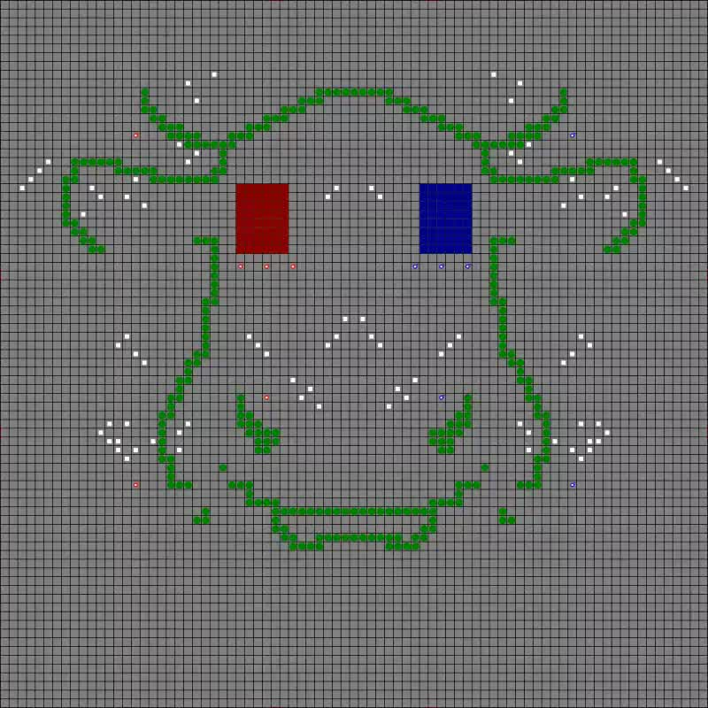

Overview
--------

This contest was organized as part of the **ProMAS'08 workshop** organized within **AAMAS 2008**.

* **Submission of the description:** March 7th, 2008
* **Notification:** March 10th, 2008
* **Camera-Ready of the Description:** March 12th, 2008
* **Competition:** Monday May 26th 2008 at 10:00 CEST (GMT+2)
* **Winner announcement:** After Competition

Winner
------

The winner is JIAC-TNG from DAI Labor at Technische Universität Berlin.

Organizers
----------

* Tristan M. Behrens, [Clausthal University of Technology](https://www.tu-clausthal.de/),
* [Mehdi Dastani](https://www.uu.nl/medewerkers/MMDastani), [Utrecht University](https://www.uu.nl/),
* [Jürgen Dix](https://www.ifi-ci.tu-clausthal.de/members/leader/prof-dr-juergen-dix) , [Clausthal University of Technology](https://www.tu-clausthal.de/),
* [Peter Novák](http://peter.aronde.net/), [Clausthal University of Technology](https://www.tu-clausthal.de/).

Aims and Scope
--------------

This competition is an attempt to stimulate research in the area of multi-agent system development and programming by

1. identifying key problems and
2. collecting suitable benchmarks

that can serve as milestones for testing multi-agent programming languages, platforms and tools. We also expect that participating at the contest helps to debug existing systems and to identify their weak and strong aspects.

The performance of a particular system will be determined in a series of games where the systems compete against each other. While winning the competition is not the main point, we hope it will shed light on the applicability of certain frameworks to particular domains.

Scenario Description
--------------------

This contest consists of applying (or developing from scratch) a multi-agent system to solve a cooperative task in a highly dynamic environment. The environment of the multi-agent system is a grid-like world in which animals (e.g., cows) are moving around collectively in one or more groups showing swarm like behaviour. There are two corrals each belongs to one of the agent teams. The teams of agents compete to control the behavior of animals and lead them to their own corral. The winning agent team is the one that has a higher number of cows collected in its corrals. The technical description of the scenario will be published soon (15 February) on the contest webpage.

We encourage submissions that specify and design a multi-agent system in terms of high-level concepts such as goals, beliefs, plans, roles, communication, coordination, negotiation, and dialogue in order to generate an efficient and effective solution for the above mentioned application. Moreover, the use of agent-oriented programming languages, platforms, tools, and techniques in the implementations of multi-agent system is appreciated.

Story
-----

An unknown species of cattle was recently discovered in the unexplored flatlands of Lemuria. The cows have some nice features: their carbondioxyde- and ethane-output is extremely low compared to the usual cattle and their beef and milk are of supreme quality and taste.

These facts definitely caught the attention of the beef- and milk-industries. The government decided to allow the cows to be captured and bred by everyone who is interested and has the capabilities. Several well-known companies decided to send in their personnel to the fields to catch as many of them as possible. This led to an unprecedented rush for cows. To maximize their success the companies replaced their traditional cowboys by artificial herders. In this year’s agent contest the participants have to compete in an environment for cows. Each team controls a set of herders in order to direct the cows into their own corral. The team with the most cows in the corral at the end wins the match.

Results
-------

**The winner is JIAC-TNG from DAI Labor at Technische Universität Berlin.** Congratulations!

<figure>
  <video controls>
    <source src="GridSimulation_JIAC-TNGJadex_CowSkullMountain_2008-05-28_12-05.webm" type="video/webm">
    
  </video>
  <figcaption>JIAC-TNG against Jadex on CowSkullMountain</figcaption>
</figure>

These are the final scores:

Position | Teamname | Cowscore | Points | Location
--- | --- | --- | --- | ---
1 | JIAC-TNG | 643 | 46 | Technische Universität Berlin, Germany
2 | Jadex | 542 | 42 | Hamburg University of Applied Sciences, Germany
3 | SHABaN | 373 | 37 | Iran University Of Science and Technology
4 | krzaczory | 379 | 26 | Forschungszentrum Dresden-Rossendorf, Germany
5 | Jason | 393 | 21 | ENS Mines of Saint Etienne, France, and University of Durham, UK
6 | bogtrotters | 305 | 13 | University College Dublin, Ireland
7 | KANGAL | 32 | 1 | Bogazici University, Istanbul, Turkey

Downloads
---------

* Call for Submissions: [ac08-cfs.txt](ac08-cfs.txt)
* Postproceedings template: [ac08-postproceedings-template.tex](ac08-postproceedings-template.tex)
* [protocol.pdf](protocol.pdf)
* [scenario-r4.220.pdf](scenario-r4.220.pdf)
