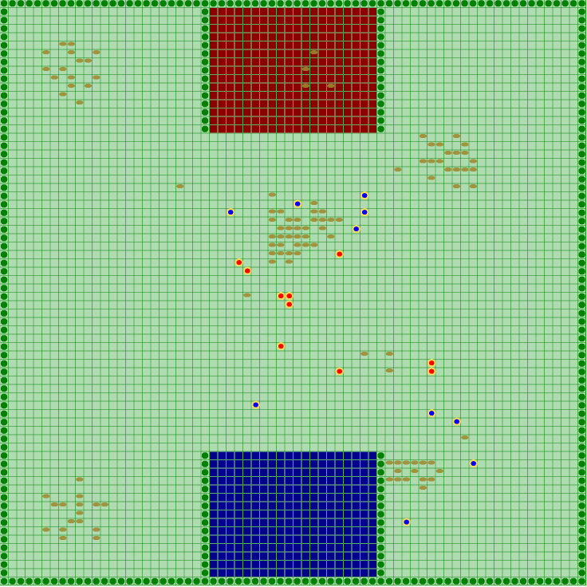
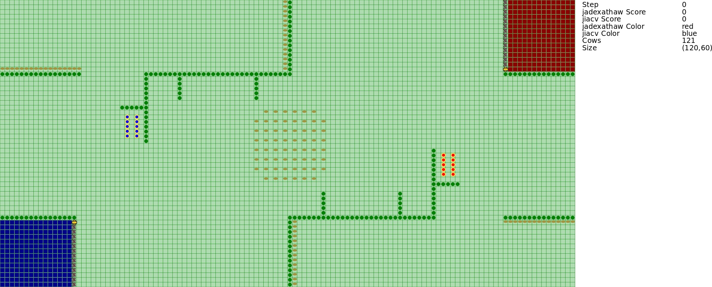

Overview
--------

This contest was organized as part of the ProMAS'09 workshop organized within AAMAS 2009. Post proceedings where published with the CLIMA-X workshop. The contest consisted of applying (or developing from scratch) a multi-agent system to solve a cooperative task in a highly dynamic environment. The environment of the multi-agent system was a grid-like world in which animals (e.g., cows) are moving around collectively in one or more groups showing swarm like behaviour. There were two corrals each belongs to one of the agent teams. The teams of agents competed to control the behavior of animals and lead them to their own corral. The winning agent team was the one that has a higher number of cows collected in its corrals.

* **Submission of the description:** 27.04.2009
* **Notification:** 04.05.2009
* **Camera-Ready of the Description:** 11.05.2009
* **Competition:** 11.08.2009 - 03.09.2009
* **Winner announcement:** 07.09.2009

Winner
------

JIAC V, Technical University Berlin, Germany.

The winner of this year's contest got  a cheque of **500 Euros** for Springer books.

Organizers
----------

* Tristan M. Behrens, [Clausthal University of Technology](http://www.tu-clausthal.de/),
* [Mehdi Dastani](http://www.cs.uu.nl/~mehdi/), [Utrecht University](http://www.uu.nl/),
* [Jürgen Dix](http://www.in.tu-clausthal.de/divisions/cig/cigroot/members/leader/cigmember-dix/), [Clausthal University of Technology](http://www.tu-clausthal.de/),
* Michael Köster, [Clausthal University of Technology](http://www.tu-clausthal.de/),
* [Peter Novák](http://peter.aronde.net/), [http://www.tu-clausthal.de/](Clausthal University of Technology).

Aims and Scope
--------------

This competition is an attempt to stimulate research in the area of multi-agent system development and programming by

1. identifying key problems and
2. collecting suitable benchmarks
   that can serve as milestones for testing multi-agent programming languages, platforms and tools.

We also expect that participating at the contest helps to debug existing systems and to identify their weak and strong aspects.

The performance of a particular system will be determined in a series of games where the systems compete against each other. While winning the competition is not the main point, we hope it will shed light on the applicability of certain frameworks to particular domains.

Scenario Description
--------------------

This contest consists of applying (or developing from scratch) a multi-agent system to solve a cooperative task in a highly dynamic environment. The environment of the multi-agent system is a grid-like world in which animals (e.g., cows) are moving around collectively in one or more groups showing swarm like behaviour. There are two corrals each belongs to one of the agent teams. The teams of agents compete to control the behavior of animals and lead them to their own corral. The winning agent team is the one that has a higher number of cows collected in its corrals. The technical description of the scenario will be published soon (15 February) on the contest webpage.

We encourage submissions that specify and design a multi-agent system in terms of high-level concepts such as goals, beliefs, plans, roles, communication, coordination, negotiation, and dialogue in order to generate an efficient and effective solution for the above mentioned application. Moreover, the use of agent-oriented programming languages, platforms, tools, and techniques in the implementations of multi-agent system is appreciated.

Story
-----

An unknown species of cattle was recently discovered in the unexplored flatlands of Lemuria. The cows have some nice features: their carbondioxyde- and ethane-output is extremely low compared to the usual cattle and their beef and milk are of supreme quality and taste.

These facts definitely caught the attention of the beef- and milk-industries. The government decided to allow the cows to be captured and bred by everyone who is interested and has the capabilities. Several well-known companies decided to send in their personnel to the fields to catch as many of them as possible. This led to an unprecedented rush for cows. To maximize their success the companies replaced their traditional cowboys by artificial herders. In this year’s agent contest the participants have to compete in an environment for cows. Each team controls a set of herders in order to direct the cows into their own corral. The team with the most cows in the corral at the end wins the match.

<video controls>
  <source src="mapc2009.mp4" type="video/mp4">
  <source src="mapc2009.webm" type="video/webm">
  
</video>

Participation Requirements
--------------------------

The participation in this contest consists of two parts:

1. Submission of the description of analysis, design and implementation of a multi-agent system for the above application. The maximum length is 5 pages according to the LNCS format.
2. Participation in the contest tournament by means of an (executable) implementation of a multi-agent system.

Results
-------

The Multi-Agent Contest 2009 Edition is over! We the organizers are happy to announce this years' winner!

**Congratulations to the team JIAC Vi**

Their agentsamanaged to collect 1627 cows and scored 60 points! Very well done!

Here are the results:

Pos. | Teamname | CowScore | Diff. | Points | Location
--- | --- | --- | --- | --- | ---
1 | jiacv | 1627 : 283 | 1344 | 60 | Technical University Berlin, Germany
2 | jadexathaw | 1345 : 280 | 1065 | 57 | Hamburg University of Applied Sciences, Germany
3 | romanfarmers | 840 : 700 | 140 | 37 | University of São Paulo, Brazil; Federal University of Santa Catarina, Brazil; Federal University of Rio Grande do Sul, Brazil
4 | jasondtu | 433 : 772 | -339 | 30 | Technical University of Denmark
5 | smaperteam | 194 : 568 | -374 | 23 | RMIT University, Melbourne, Australia
6 | microjiac | 363 : 851 | -488 | 21 | Technical University Berlin, Germany
7 | afable | 468 : 821 | -353 | 20 | UCD School of Computer Science and Informatics, Dublin, Ireland
8 | unknown | 12 : 1007 | -995 | 1 | Clausthal University of Technology

During the week we ran 28 matches with all in all 84 simulations. All the simulations can be found below. You can view the SVG-videos with the newest Firefox. Thanks to everyone that has participated! You have stimulated research in the field of Multi-Agent Systems Programming! For more than a year we have invested a lot of time in improving the contest. We have had a lot of ups and downs during all those months. Today we are very satisfied that the contest has been a success. We will present the contest and announce the winner at the CLIMA workshop. We are looking forward to meeting some of you there! And of course, we should not forget the price! The winning team will get 500 EUR from Springer Verlag to buy books.

Also see the [complete individual match results](/2009/40-results-of-2009/).

Downloads
---------

* [AC09 Submissions Template](ac09-submissions-template.tex) (tex)
* [Alpha MASSim config editor](SimpleMassimEditor.jar) (jar)
* [MASSim Software Package (Server, Monitor, Agents)](massim-20090717-v1.2.tar.bz2) (tar.bz2)
* [Protocol](protocol.pdf)
* [Scenario 2009](scenario.pdf)
