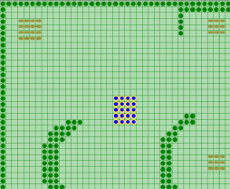
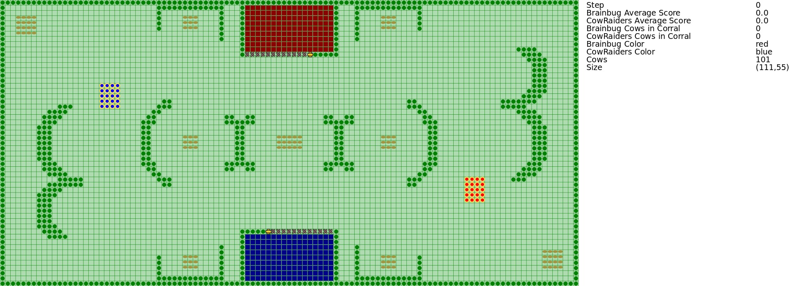

Overview
--------

This contest was organized as part of the ProMAS 2010 workshop organized within AAMAS 2010. The contest consisted of applying (or developing from scratch) a multi-agent system to solve a cooperative task in a highly dynamic environment. The environment of the multi-agent system was a grid-like world in which animals (e.g., cows) are moving around collectively in one or more groups showing swarm like behaviour. There were two corrals each belongs to one of the agent teams. The teams of agents competed to control the behavior of animals and lead them to their own corral. The winning agent team was the one that has a higher number of cows collected in its corrals.

* **Submission of the description:** 9th August 2010
* **Competition:** 6th September 2010 - 10th September 2010
* **Winner announcement:** 13th September 2010

Winner
------

**Brainbug (JIAC V)** consisting of Fabian Linges, Sönke Sieckmann, Erik Stürmer, Jonathan Ziller and Axel Heßler of Technische Universität Berlin, Germany.

500€ Prize to the Winner
------------------------

We are proud to announce that the winner of this year's contest will get a cheque of 500 Euros for Springer books.

Organizers
----------

* Tristan M. Behrens, [Clausthal University of Technology](https://www.tu-clausthal.de/),
* [Jürgen Dix](https://www.ifi-ci.tu-clausthal.de/members/leader/prof-dr-juergen-dix), [Clausthal University of Technology](https://www.tu-clausthal.de/),
* [Jomi Hübner](https://jomi.das.ufsc.br/), [Federal University of Santa Catarina](https://www.ufsc.br/),
* Michael Köster, [Clausthal University of Technology](https://www.tu-clausthal.de/).

Steering Committee
------------------

* [Mehdi Dastani](https://www.uu.nl/medewerkers/MMDastani), [Utrecht University](https://www.uu.nl/),
* [Jürgen Dix](https://www.ifi-ci.tu-clausthal.de/members/leader/prof-dr-juergen-dix), [Clausthal University of Technology](https://www.tu-clausthal.de/),
* [Peter Novák](http://peter.aronde.net/), [Czech Technical University](http://www.cvut.cz/).

Aims and Scope
--------------

This competition is an attempt to stimulate research in the area of multi-agent system development and programming by

1. identifying key problems,
2. collecting suitable benchmarks, and
3. gathering test cases which require and enforce coordinated action

that can serve as milestones for testing multi-agent programming languages, platforms and tools. We also expect that participating at the contest helps to debug existing systems and to identify their weak and strong aspects.

The performance of a particular system will be determined in a series of games where the systems compete against each other. While winning the competition is not the main point, we hope it will shed light on the applicability of certain frameworks to particular domains.

Scenario
--------

<video controls>
  <source src="mapc2010.webm" type="video/webm">
  
</video>

The contest scenario consists of developing a multi-agent system to solve a cooperative task in a dynamic environment. The environment is a grid-like world in which virtual cows are moving around collectively in one or more herds exhibiting a swarm-like behavior. There are two corrals, each belongs to one of the two agent teams. The teams of agents compete to control the behavior of animals and lead them to their own corral. The winning agent team is the one that scores highest. A detailed scenario description of the scenario will be available in time.

Participation requirements
--------------------------

The participation in this contest consists of these parts:

1. Declaring the intent to participate by registering to the mailing list.
2. Submission of the description of analysis, design and implementation of a multi-agent system for the above application. Thus registering to the contest officially.
3. Participation in the contest tournament by taking part on the final tournament.
4. Submitting the source-code of your application right after the tournament.

Details about the Participants
------------------------------

Team | Affiliation | Country | Members (contact in italic) | Language | Hours
--- | --- | --- | --- | --- | ---
Brainbug | Technische Universität Berlin | Germany | Fabian Linges, Sönke Sieckmann, Erik Stürmer, Jonathan Ziller, *Axel Heßler* | JIAC V | 320
Argonauts | Technische Universität Dortmund | Germany | A. Löwen, B. Jablkowski, Cai W., D. Hölzgen, E. Böhmer, F. Bienek, M. Kruse, S. Broszeit, T. Vengels | Jason & DLV | 1536
CowRaiders | Technische Universität Berlin, Universidade Federal do Rio Grande do Sul | Germany, Brazil | Bettina Feldheim, Erik Petzhold, Michael Müller, Verena Klös, *Marcel Patzlaff*, Jonas Hartmann | MicroJIAC | 350
USP Farmers | University of São Paulo | Brazil | Gustavo P. Gouveia, *Ricardo H. Pereira*, and Jaime S. Sichman | Jason | 1400
UCD Bogtrotters | University College Dublin | Ireland | Sean Russell, *Rem Collier*, Mauro Dragone | AF-ABLE | 112
Jason-DTU | Technical University of Denmark | Denmark | *Jørgen Villadsen*, Niklas Skamriis Boss, Andreas Schmidt Jensen, and Steen Vester | Jason | 100
PauLo Swiss | Berne University of Applied Sciences | Switzerland | *Christian Loosli*, Adrian Pauli | Java | 250
Galoan | Islamic Azad University-Malayer Branch | Iran | *Vahid Rafe*, Aghil Bayat, Mohammad Rezaei, Yousef Pournaghi | Java | 400

Software Package
----------------

The package (see below for downloads) contains:

* the scenario-description,
* the protocol-description that explains the communication-protocol,
* the MASSim-server itself,
* two maps for testing your agents,
* the cow-monitor that lets you inspect the state of the simulation,
* a rudimentary level-editor,
* rudimentary dummy agents, and
* shell-scripts for starting things.

This is everything you need to dive headfirst into developing your solution for the contest.

This year you have several choices on how to get started. You could use the dummy-agents that are included in the package. Also you can create a connector completely from scratch respecting the
protocol-description. Of course you can reuse your previous solution if you have already participated.
Finally you can support the EIS-project and use its own connector:
[http://sourceforge.net/projects/apleis](http://sourceforge.net/projects/apleis).

This year we offer the rudimentary level-editor right from the beginning. Feel free to use it for level-editing. Feel also free to extend the editor if necessary, the sources are included in the package. Please let us know
if you have created any maps. We want to review them and maybe make them available to others.

Results
-------

Congratulations to the team **Brainbug (JIAC V)**!

The team consisting of Fabian Linges, Sönke Sieckmann, Erik Stürmer, Jonathan Ziller and Axel Heßler of Technische Universität Berlin, Germany were able to get 57 points.

They achieved almost 190 cow-average points. Well done!

Here are the results of all teams:

Pos. | Teamname | CowScore | Diff. | Points
--- | --- | --- | --- | ---
1 | Brainbug | 189.5927 : 39.4007 | 150.1920 | 57
2 | CowRaiders | 120.2327 : 106.9880 | 13.2447 | 48
3 | UCDBogtrotters | 79.0180 : 43.2433 | 35.7747 | 46
4 | Galoan | 105.9907 : 69.3920 | 36.5987 | 36
5 | Argonauts | 54.6213 : 72.0073 | -17.3860 | 29
6 | Jason-DTU | 81.1300 : 106.1847 | -25.0547 | 20
7 | PauLo | 17.4180 : 119.9907 | -102.5727 | 11
8 | USPFarmers | 30.9967 : 121.7933 | -90.7967 | 1

During the week we ran 28 matches with all in all 84 simulations.

Thanks to everyone that has participated! You have stimulated research in the field of Multi-Agent Systems Programming!

And of course, we should not forget the price! The winning team will get 500 EUR from Springer Verlag to buy books.

Also see the [complete individual match results](/2010/78-results2010/).

Downloads
---------

* [massim-2010-07-29.tar.bz2](massim-2010-07-29.tar.bz2)
  * officially released package
* [massim-2010.zip](massim-2010.zip)
  * repackaged version from end of 2010; includes eismassim and javaagents
* [registration-template.tex](registration-template.tex)
* [protocol.pdf](protocol.pdf)
* [scenario.pdf](scenario.pdf)
* Sources:
  - [argonauts.tar.xz](sources/argonauts.tar.xz)
  - [bogtrotters.zip](sources/bogtrotters.zip)
  - [brainbug.tar.xz](sources/brainbug.tar.xz)
  - [cowraiders.tar.xz](sources/cowraiders.tar.xz)
  - [galoan.rar](sources/galoan.rar)
  - [jason-dtu.zip](sources/jason-dtu.zip)
  - [paulo.jar](sources/paulo.jar), [paulo.zip](sources/paulo.zip)
  - [uspfarmers.tar.xz](sources/uspfarmers.tar.xz)

<!-- TODO: Videos and stuff -->
