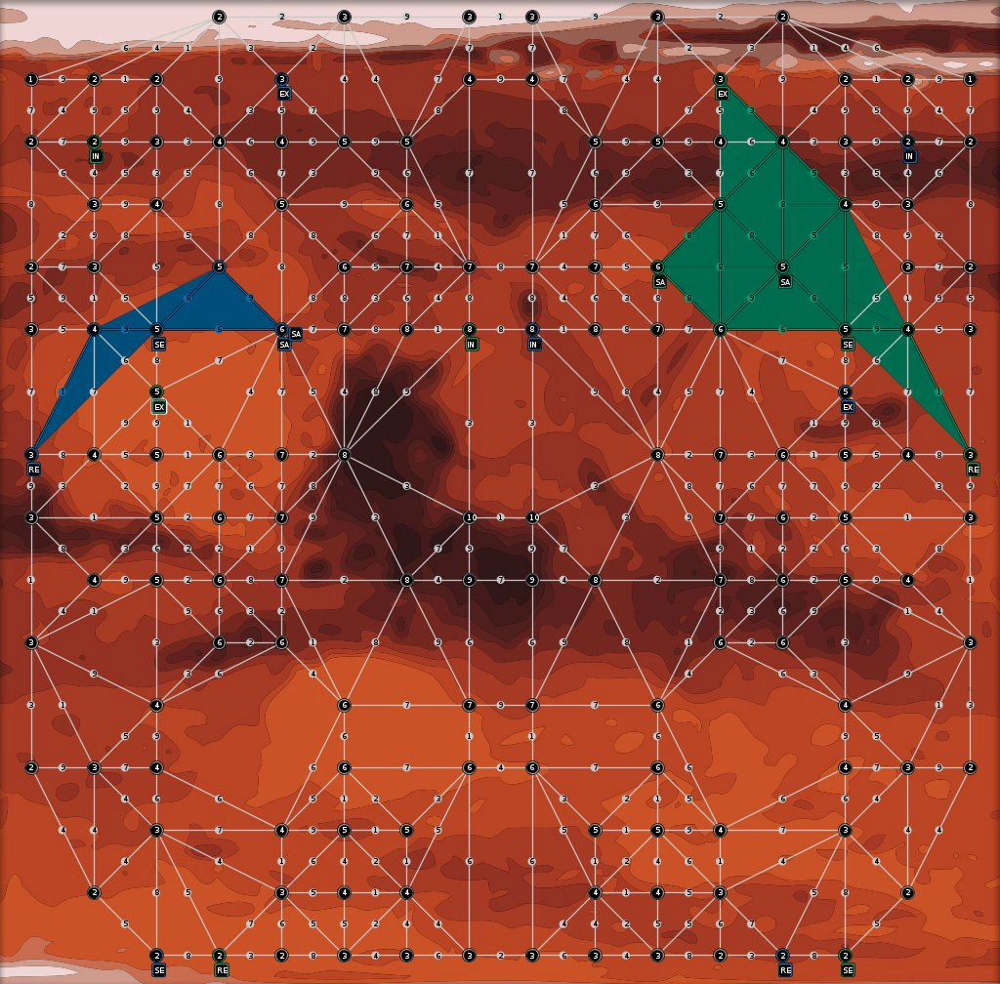

Overview
--------

In 2011 the contest was organized together with ProMAS 2011 workshop within AAMAS 2011. The contest scenario "Agents on Mars" consisted of developing a multi-agent system to solve a cooperative task in a dynamic environment. The goal was to implement a team of cooperating agents with different roles in order to occupy zones on planet Mars.

* **January 2011:** release of the first software package
* **Until June 2011:** preparing the final software package
* **June 2011:** release of the final software package
* **September 2011:** tournament

Winner
------

This year's winner is **HACTAR V2 from TU Delft**.

We congratulate our Dutch friends wholeheartedly! The team of Pieter Hameete, Jeff Smits, Sebastiaan Leysen, Marc Dekker, Joris Van Den Oever, Michiel Hegemans and Koen Hindriks won 24 matches getting a phenomenal score of 72 tournament points and 2,979,591 simulation points. The team won every single simulation!

The winner of the contest was awarded with a voucher for 500 EUR worth in books, thankfully provided by Springer Verlag.

Organizers
----------

* Tristan Behrens, [Clausthal University of Technology](https://www.tu-clausthal.de/),
* [Jürgen Dix](https://www.ifi-ci.tu-clausthal.de/members/leader/prof-dr-juergen-dix), [Clausthal University of Technology](https://www.tu-clausthal.de/),
* [Jomi Hübner](https://jomifred.github.io/), [Federal University of Santa Catarina](http://www.ufsc.br/),
* Michael Köster, [Clausthal University of Technology](https://www.tu-clausthal.de/),
* Federico Schlesinger, [Clausthal University of Technology](https://www.tu-clausthal.de/).

Aims and Scope
--------------

This competition is an attempt to stimulate research in the area of multi-agent system development and programming by

1. identifying key problems,
2. collecting suitable benchmarks, and
3. gathering test cases which require and enforce coordinated action

that can serve as milestones for testing multi-agent programming languages, platforms and tools. We also expect that participating at the contest helps to debug existing systems and to identify their weak and strong aspects.
The performance of a particular system will be determined in a series of games where the systems compete against each other. While winning the competition is not the main point, we hope it will shed light on the applicability of certain frameworks to particular domains.

Participation requirements
--------------------------

The participation in this contest consisted of these parts:

1. Declaring the intent to participate by registering to the mailing list.
2. Submission of the description of analysis, design and implementation of a multi-agent system for the above application. Thus registering to the contest officially.
3. Participation in the contest tournament by taking part on the final tournament.
4. Submitting the source-code of your application right after the tournament.

Agents on Mars
--------------

<video controls>
  <source src="mapc2011.webm" type="video/webm">
  
</video>

*In the year 2033 mankind finally populates Mars. While in the beginning the settlers received food and water from transport ships sent from earth shortly afterwards - because of the outer space pirates - sending these ships became too dangerous and expensive. Also, there were rumors going around that somebody actually found water on Mars below the surface. Soon the settlers started to develop autonomous intelligent agents, so-called All Terrain Planetary Vehicles (ATPV), to search for water wells. The World Emperor - enervated by the pirates - decided to strengthen the search for water wells by paying money for certain achievements. Sadly, this resulted in sabotage among the different groups of settlers.*

Now, the **task of your agents** is to **find the best water wells and occupy the best zones of Mars**. Sometimes they have to **sabotage their rivals** to achieve their goal (while the opponents will most probably do the same) or to defend themselves. Of course the agents' vehicle pool contains specific vehicles, some of them have special sensors, some of them are faster and some of them have sabotage devices on board. Last but not least, your team also contains special experts, the repair agents, that are capable of fixing agents that are disabled. In general, each agent has a special expert knowledge and is thus the only one being able to perform a certain action. So your **agents have to find ways to cooperate and coordinate themselves**.

The Challenge
-------------

In this year's contest your agents have to prove themselves on planet Mars. The environment is represented by a graph. Vertices denote water wells of different value and possible locations for the agents. The weights of the edges denote the costs of traversing the edge. Your agents have to conquer zones. A zone is a subgraph that is colored in your team's color. Once you place your agents at strategic positions they color the nodes they are standing on and neighboring nodes. If you occupy such a zone you get as many points as your zone is worth. The goal of the game is to maximize your score, while your opposing team is highly probable to do the same. The map is unknown in the beginning. Explore the area first before conquering zones. And make sure that you properly defend your zones against your enemies.

Your Agents: All Terrain Planetary Vehicles
-------------------------------------------

You have 20 agents and 5 roles with 4 agents per role. Your explorers can find water wells and help to explore the map. The sentinels have long distance-sensors and can observe huge areas. Your saboteurs can attack and deactivate your enemies. The inspectors can spy on your opponent's agents. And your repairers can restore your damaged agents.

The Tournament
--------------

Your team will play against all others. Each match has several rounds. The team that wins most rounds wins the overall tournament. You can connect your agents via internet to our servers and watch the simulations online and in real-time.

### Details about the Participants

Team | Affiliation | Country | Persons | Language
--- | --- | --- | --- | ---
Nargel | Arak University | Iran | Vahid Rafe; Rosa Yousefian; Majid Fandrousi; Sina Hamedheidari | Java (JADE)
Simurgh | Arak University | Iran | Sahar Mirzayi; Fateme Eskandari; Vahid Nateghi | Java (JADE)
Savior | Islamic Azad University-Malayer Branch | Iran | Mohammad Rezaei; Aghil Bayat; Yousef Pournaghi | Java
Python-DTU | Technical University of Denmark | Denmark | Jørgen Villadsen; Mikko Berggren Ettienne; Steen Vester | Python
HempelsSofa | Georg-August-Universitat Gottingen | Germany | Julius Faber; David Goltzsche; Christoph Rauterberg; Sven Reglitzki | Java
Sorena | Arak University | Iran | Alireza Hasanpour; Katayon Khatibifar; Naser Fallahi | JACK
HactarV2 | TU Delft | Netherlands | Pieter Hameete; Jeff Smits; Sebastiaan Leysen; Marc Dekker; Joris Van Den Oever; Michiel Hegemans; Koen Hindriks | GOAL
d3lp0r | Universidad Nacional del Sur | Argentina | Diego Marcovecchio; Leonardo Molas; Iñaki Garay; Fernando Sisul; Manuel Torres; Emiliano Montenegro; Sebastian Gottifredi; Mauro Gomez; Diego Martinez; Guillermo Simari; Alejandro Garcia | Prolog/Python
TUB | Technische Universitat Berlin | Germany | Axel Hessler; Thomas Konnerth; Pawel Napierala; Benjamin Wiemann | JIAC V
UCD Bogtrotters | University College Dublin | Ireland | Rem Collier; Sean Russell | AF-TeleoReactive; AF-AgentSpeak

### Results

Pos. | Teamname | Score | Difference | Points
--- | --- | --- | --- | --- | ---
1 | HactarV2 | 2,979,591 : 734,185 | 2,245,406 | 72
2 | Python-DTU | 3,468,448 : 745,940 | 2,722,508 | 60
3 | TUB | 2,835,401 : 914,883 | 1,920,518 | 57
4 | UCDBogtrotters | 2,379,663 : 1,459,391 | 920,272 | 45
5 | HempelsSofa* | 1,243,262 : 2,185,634 | -942,372 | 36
6 | Simurgh | 928,893 : 2,219,281 | -1,290,388 | 18
7 | Sorena | 888,631 : 2,366,805 | -1,478,174 | 15
8 | d3lp0r | 888,837 : 3,821,088 | -2,932,251 | 15
9 | Nargel | 765,296 : 1,930,815 | -1,165,519 | 6

* Out of competition

Also see the [complete results of the individual matches](/2011/96-results2011/).

Downloads
---------

### Software Package

[massim-2011-1.0.2-bin.zip](massim-2011-1.0.2-bin.zip)

In that package you will find:

1. the MASSim-Server, including the Agents-on-Mars-scenario,
2. a monitor for viewing the environment,
3. very simple dummy-agents,
4. an environment-interface for connecting to the server, and
5. extensive documentation of all components.

In order to get started, just unpack the archive and read the readmefirst.pdf.

### Sources

* [HactarV2_Code.zip](sources/HactarV2_Code.zip)
* [MAPC2011-Python-DTU.zip](sources/MAPC2011-Python-DTU.zip)
* [Nargel.rar](sources/Nargel.rar)
* [ProgContest-UCDBogtrotters.zip](sources/ProgContest-UCDBogtrotters.zip)
* [Simurgh-Agents-1.0.4.rar](sources/Simurgh-Agents-1.0.4.rar)
* [agentsHempelsSofa.tar.gz](sources/agentsHempelsSofa.tar.gz)
* [d3lp0r.tar.bz2](sources/d3lp0r.tar.bz2)
* [javaagents_Sorena.rar](sources/javaagents_Sorena.rar)
* [tub-mapc11.zip](sources/tub-mapc11.zip)

<!-- TODO: Videos, SVGs etc. -->
