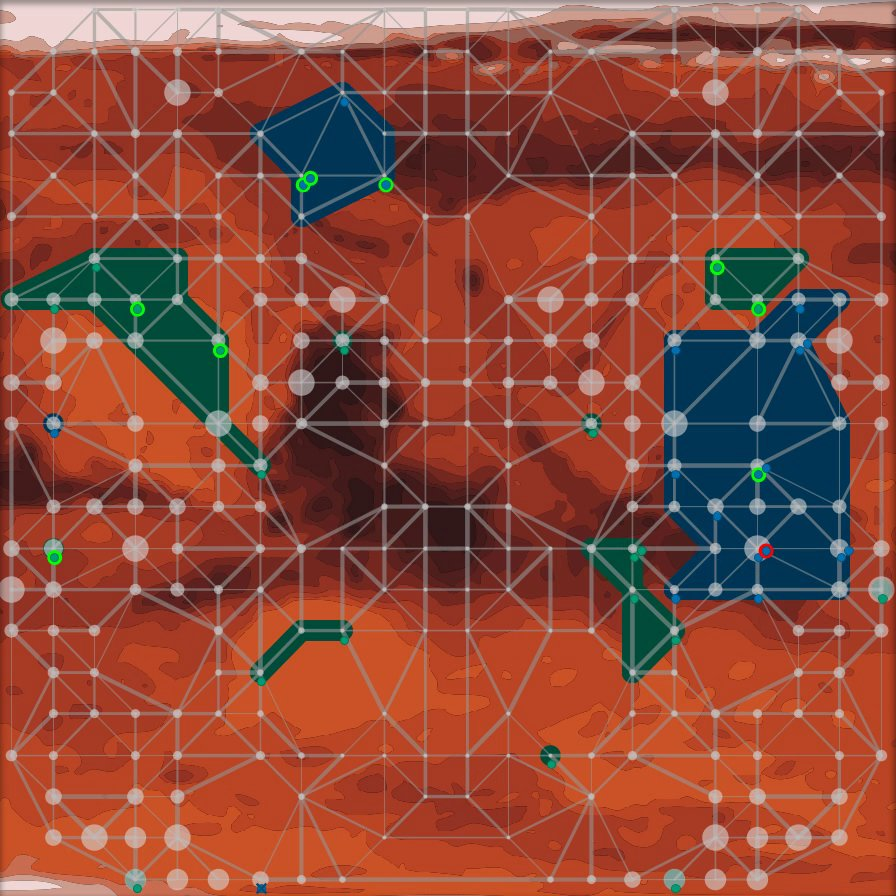

Overview
--------

This contest was organized as part of the ProMAS 2012 workshop organized within AAMAS 2012. The contest consisted of applying existing or implementing a new multi-agent system to solve a cooperative task in a highly dynamic environment.

* **May 2012:** Testing Phase
* **6th - 27th August 2012:** Registration Phase
* **5th and 6th September 2012:** Qualification Phase
* **10th - 13th September 2012:** Tournament
* **17th September 2012:** Submission of the Source Code
* **15th October 2012:** Submission of Papers
* **1st January 2012:** Publishing the selected papers in ProMAS
* **1st May 2013:** Publishing the Technical Report with all details

Winner
------

The MAPC 2012 is over and we are very happy to announce the winner: **UFSC from Federal University of Santa Catarina**.

The agents of **Jomi F. Hübner, Maicon Rafael Zatelli, Jose Rodrigo Ferreira, Tiago Luiz Schmitz, Daniela Maria Uez and Jessica Pauli de Casto Bonson** scored 51 points! They were defeated in only a single match against **Python-DTU who came in second**!

The winner of the contest was awarded with a voucher for 500 EUR worth in books, thankfully provided by Springer Verlag.

Aims and Scope
--------------

This competition is an attempt to stimulate research in the area of multi-agent system development and programming by

1. identifying key problems,
2. collecting suitable benchmarks, and
3. gathering test cases which require and enforce coordinated action

that can serve as milestones for testing multi-agent programming languages, platforms and tools. We also expect that participating at the contest helps to debug existing systems and to identify their weak and strong aspects.

The performance of a particular system will be determined in a series of games where the systems compete against each other. While winning the competition is not the main point, we hope it will shed light on the applicability of certain frameworks to particular domains.

Participation Requirements
--------------------------

The participation in this contest consists of these parts:

1. Declaring the intent to participate by registering to the mailing list.
2. Submission of a short team description. Thus registering to the contest officially.
3. Participation in the contest tournament by taking part on the final tournament.
4. Submitting the source-code of your application right after the tournament.
5. Submission of a paper after the tournament.

Agents on Mars
--------------

<video controls>
  <source src="mapc2012.mp4" source="video/mp4">
  <source src="mapc2012.webm" source="video/webm">
  
</video>

*In the year 2033 mankind finally populates Mars. While in the beginning the settlers received food and water from transport ships sent from earth shortly afterwards - because of the outer space pirates - sending these ships became too dangerous and expensive. Also, there were rumors going around that somebody actually found water on Mars below the surface. Soon the settlers started to develop autonomous intelligent agents, so-called All Terrain Planetary Vehicles (ATPV), to search for water wells. The World Emperor - enervated by the pirates - decided to strengthen the search for water wells by paying money for certain achievements. Sadly, this resulted in sabotage among the different groups of settlers.*

Now, the **task of your agents** is to **find the best water wells and occupy the best zones of Mars**. Sometimes they have to **sabotage their rivals** to achieve their goal (while the opponents will most probably do the same) or to defend themselves. Of course the agents' vehicle pool contains specific vehicles, some of them have special sensors, some of them are faster and some of them have sabotage devices on board. Last but not least, your team also contains special experts, the repair agents, that are capable of fixing agents that are disabled. In general, each agent has a special expert knowledge and is thus the only one being able to perform a certain action. So your **agents have to find ways to cooperate and coordinate themselves**.

The Challenge
-------------

In this year's contest your agents have to prove themselves on planet Mars. The environment is represented by a graph. Vertices denote water wells of different value and possible locations for the agents. The weights of the edges denote the costs of traversing the edge. Your agents have to conquer zones. A zone is a subgraph that is colored in your team's color. Once you place your agents at strategic positions they color the nodes they are standing on and neighboring nodes. If you occupy such a zone you get as many points as your zone is worth. The goal of the game is to maximize your score, while your opposing team is highly probable to do the same. The map is unknown in the beginning. Explore the area first before conquering zones. And make sure that you properly defend your zones against your enemies.

Your Agents: All Terrain Planetary Vehicles
-------------------------------------------

You have 20 agents and 5 roles with 4 agents per role. Your explorers can find water wells and help to explore the map. The sentinels have long distance-sensors and can observe huge areas. Your saboteurs can attack and deactivate your enemies. The inspectors can spy on your opponent's agents. And your repairers can restore your damaged agents.

The Tournament
--------------

Your team will play against all others. Each match has several rounds. The team that wins most rounds wins the overall tournament. You can connect your agents via internet to our servers and watch the simulations online and in real-time.

### The Participants

Team | Affiliation | Country | Persons | Platform
--- | --- | --- | --- | ---
AiWYX | Sun Yat-Sen University | China | Chengqian Li | C++
PGIM | Islamic Azad University of Malayer | Iran | Vahid Rafe; Hamed Alvandi; Hossein Abolhassani | Prometheus, JACK
LTI-USP | University of Sao Paulo | Brazil | Marina Ramos Franco; Luciano Menasce Rosset; Jaime Simao Sichman | Jason, CArtAgO, Moise
SMADAS-UFSC | Federal University of Santa Catarina | Brasil | Jomi F. Hübner; Maicon Rafael Zatelli; Jose Rodrigo Ferreira; Tiago Luiz Schmitz; Daniela Maria Uez; Jessica Pauli de Casto Bonson | Jason
Python-DTU | Technical University of Denmark | Denmark | Jørgen Villadsen; Andreas Schmidt Jensen; Mikko Berggren Ettienne; Steen Vester; Kenneth Balsiger Andersen; Andreas Frøsig | Python
Streett | | USA | Christopher Streett | Java
Targaryen | Clausthal University of Technology | Germany | Kilian Stöpler; Daniel Figge; Sven Zirkmann | Java
TUB | TU Berlin | Germany | Axel Hessler | JIAC
Bogtrotters | University College Dublin | Ireland | Rem Collier; Sean Russell | ASTRA

### Results

Pos. | Teamname | Score | Difference | Points
--- | --- | --- | --- | ---
1 | UFSC | 2778057 : 1043023 | 1735034 | 51
2 | Python-DTU | 2738397 : 1095251 | 1643146 | 48
3 | TUB | 2090849 : 1600914 | 489935 | 30
4 | USP | 1627177 : 1845601 | -218424 | 27
5 | AiWYX | 2301358 : 1526768 | 774590 | 24
6 | PGIM | 1130432 : 2047735 | -917303 | 9
7 | Streett | 192694 : 3699672 | -3506978 | 0

Also see the [complete results of the individual matches](/2012/186-results/).

Downloads
---------

* [MAPC 2012 Package](massim-2012-2.0-bin.zip)
* [Registration Template](registration.zip)
* [scenario.pdf](scenario.pdf)
* [Technical Report Template](tech-report-template.tar.bz2)
* Sources:
  - [ac12-tub-team.zip](sources/ac12-tub-team.zip)
  - [AiWYX+MAPC+source+code.zip](sources/AiWYX+MAPC+source+code.zip)
  - [lti-agents-on-mars.zip](sources/lti-agents-on-mars.zip)
  - [MAPC2012-Python-DTU.zip](sources/MAPC2012-Python-DTU.zip)
  - [MAPC-UFSCTeam2012.zip](sources/MAPC-UFSCTeam2012.zip)
  - [PGIM+Src.zip](sources/PGIM+Src.zip)
  - [StreettAgents.zip](sources/StreettAgents.zip)

<!-- TODO: Videos, SVGs -->
