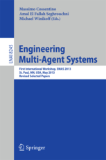
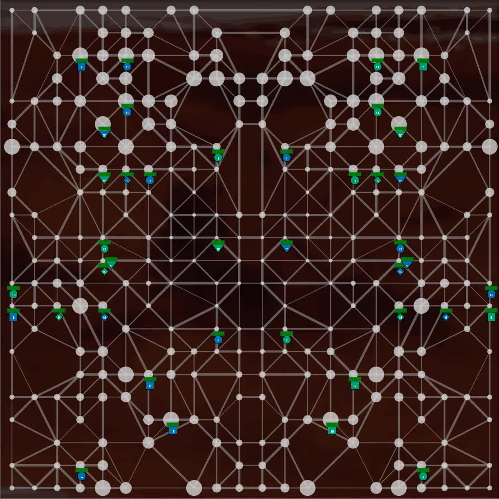

Results
-------

We are very happy to announce that the team UFSC, Federal University of Santa Catarina, Brazil won the contest again. The agents of

* Jomi Fred Hübner
* Maicon Rafael Zatelli
* Maiquel de Brito
* Tiago Luiz Schmitz
* Daniela Maria Uez
* Marcelo Menezes Morato
* Kaio Siqueira de Souza

scored 36 points and did not loose one simulation! On second place is (as in the last two years) the group of Jørgen Villadsen, TU Denmark, with the team GOAL-DTU.

Here is the ranking:

Pos. | Teamname | Score | Difference | Matches | Simulations | Points
--- | --- | --- | --- | --- | --- | ---
1 | UFSC | 2702948 : 1455163 | 1247785 | 4 | 12 | 36
2 | GOAL-DTU | 2284575 : 1614711 | 669864 | 4 | 12 | 27
3 | LTI-USP | 2117299 : 2083105 | 34194 | 4 | 12 | 15
4 | TUB | 1412702 : 2238820 | -826118 | 4 | 12 | 6
5 | AiWXX | 1516760 : 2642485 | -1125725 | 4 | 12 | 6

And the matches in detail:

Simulation | GOAL-DTU | AiWXX
--- | --- | ---
Mars2013_AiWXXGOAL-DTU_contest-sim1 | 195354 | 71931
Mars2013_AiWXXGOAL-DTU_contest-sim2 | 191117 | 68913
Mars2013_AiWXXGOAL-DTU_contest-sim3 | 194647 | 73627

Simulation | LTI-USP | TUB
--- | --- | ---
Mars2013_TUBLTI-USP_contest-sim1 | 191743 | 64471
Mars2013_TUBLTI-USP_contest-sim2 | 151686 | 116471
Mars2013_TUBLTI-USP_contest-sim3 | 156073 | 150546

Simulation | UFSC | AiWXX
--- | --- | ---
Mars2013_AiWXXUFSC_contest-sim1 | 344515 | 47347
Mars2013_AiWXXUFSC_contest-sim2 | 269472 | 174183
Mars2013_AiWXXUFSC_contest-sim3 | 228745 | 88703

Simulation | LTI-USP | GOAL-DTU
--- | --- | ---
Mars2013_GOAL-DTULTI-USP_contest-sim1 | 205582 | 232974
Mars2013_GOAL-DTULTI-USP_contest-sim2 | 110012 | 182436
Mars2013_GOAL-DTULTI-USP_contest-sim3 | 108518 | 180368

Simulation | TUB | UFSC
--- | --- | ---
Mars2013_UFSCTUB_contest-sim1 | 73023 | 199726
Mars2013_UFSCTUB_contest-sim2 | 92837 | 183607
Mars2013_UFSCTUB_contest-sim3 | 65856 | 233481

Simulation  | TUB | AiWXX
--- | --- | ---
Mars2013_AiWXXTUB_contest-sim1 | 225847 | 186805
Mars2013_AiWXXTUB_contest-sim2 | 90896 | 154663
Mars2013_AiWXXTUB_contest-sim3 | 159058 | 135720

Simulation  | UFSC | LTI-USP
--- | --- | ---
Mars2013_LTI-USPUFSC_contest-sim1 | 230507 | 156413
Mars2013_LTI-USPUFSC_contest-sim2 | 213397 | 156812
Mars2013_LTI-USPUFSC_contest-sim3 | 197067 | 137626

Simulation | GOAL-DTU | TUB
--- | --- | ---
Mars2013_TUBGOAL-DTU_contest-sim1 | 264550 | 154137
Mars2013_TUBGOAL-DTU_contest-sim2 | 189743 | 156497
Mars2013_TUBGOAL-DTU_contest-sim3 | 191023 | 63063

Simulation | LTI-USP | AiWXX
--- | --- | ---
Mars2013_AiWXXLTI-USP_contest-sim1 | 164073 | 302245
Mars2013_AiWXXLTI-USP_contest-sim2 | 193665 | 185458
Mars2013_AiWXXLTI-USP_contest-sim3 | 385096 | 27165

Simulation | GOAL-DTU | UFSC
--- | --- | ---
Mars2013_UFSCGOAL-DTU_contest-sim1 | 147232 | 171615
Mars2013_UFSCGOAL-DTU_contest-sim2 | 187709 | 254590
Mars2013_UFSCGOAL-DTU_contest-sim3 | 127422 | 176226

Aims and Scope
--------------

This competition is an attempt to stimulate research in the area of multi-agent system development and programming by

1. identifying key problems,
2. collecting suitable benchmarks, and
3. gathering test cases which require and enforce coordinated action

that can serve as milestones for testing multi-agent programming languages, platforms and tools. We also expect that participating at the contest helps to debug existing systems and to identify their weak and strong aspects.

The performance of a particular system will be determined in a series of games where the systems compete against each other. While winning the competition is not the main point, we hope it will shed light on the applicability of certain frameworks to particular domains.

EMAS 2013 Proceedings published
-------------------------------

The [Engineering Multi-Agent Systems 2013 (EMAS) proceedings](http://www.springer.com/computer/ai/book/978-3-642-45342-7) will be published in the next days. The book contains also all papers about the Multi-Agent Programming Contest 2013:

* Multi-Agent Programming Contest 2013
* SMADAS: A Team for MAPC Considering the Organization and the Environment as First-Class Abstractions
* Engineering a Multi-Agent System in GOAL
* Improving the LTI-USP Team: A New JaCaMo Based MAS for the MAPC 2013
* Multi-Agent Programming Contest 2013: TUB Team Description
* Prior State Reasoning in Multi-agent Systems and Graph-Theoretical Algorithms
* Multi-agent Programming Contest 2013: The Teams and the Design of their Systems.

EMAS Overview Page
------------------

Did you know the [overview page of EMAS](http://emas.in.tu-clausthal.de/) already?

Agents on Mars
--------------

<video controls>
  <source src="mapc2013-teaser.mp4" type="video/mp4">
  <source src="mapc2013-teaser.webm" type="video/webm">
  
</video>

*In the year 2033 mankind finally populates Mars. While in the beginning the settlers received food and water from transport ships sent from earth shortly afterwards - because of the outer space pirates - sending these ships became too dangerous and expensive. Also, there were rumors going around that somebody actually found water on Mars below the surface. Soon the settlers started to develop autonomous intelligent agents, so-called All Terrain Planetary Vehicles (ATPV), to search for water wells. The World Emperor - enervated by the pirates - decided to strengthen the search for water wells by paying money for certain achievements. Sadly, this resulted in sabotage among the different groups of settlers.*

Now, the **task of your agents** is to **find the best water wells and occupy the best zones of Mars**. Sometimes they have to **sabotage their rivals** to achieve their goal (while the opponents will most probably do the same) or to defend themselves. Of course the agents' vehicle pool contains specific vehicles, some of them have special sensors, some of them are faster and some of them have sabotage devices on board. Last but not least, your team also contains special experts, the repair agents, that are capable of fixing agents that are disabled. In general, each agent has a special expert knowledge and is thus the only one being able to perform a certain action. So your **agents have to find ways to cooperate and coordinate themselves**.

The Challenge
-------------

In this year's contest your agents have to prove themselves on planet Mars. The environment is represented by a graph. Vertices denote water wells of different value and possible locations for the agents. The weights of the edges denote the costs of traversing the edge. Your agents have to conquer zones. A zone is a subgraph that is colored in your team's color. Once you place your agents at strategic positions they color the nodes they are standing on and neighboring nodes. If you occupy such a zone you get as many points as your zone is worth. The goal of the game is to maximize your score, while your opposing team is highly probable to do the same. The map is unknown in the beginning. Explore the area first before conquering zones. And make sure that you properly defend your zones against your enemies.

The Tournament
--------------

Your team will play against all others. Each match has several rounds. The team that wins most rounds wins the overall tournament. You can connect your agents via internet to our servers and watch the simulations online and in real-time.

Downloads
---------

* [scenario.pdf](scenario.pdf)
