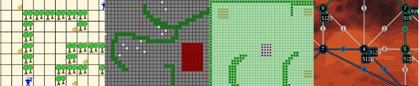

Our MASSim platform has been used extensively in teaching.
Below you will find an overview.

* Bachelor's project A.I., 2016, [Department of Informatics, Clausthal University of Technology](http://cig.in.tu-clausthal.de/).
  Held by Tobias Ahlbrecht, Jürgen Dix, and Niklas Fiekas.
  **C++/Goal/Jason** and MASSim using the **agents-in-the-city scenario**.

* Multi-Agent Systems - Research & Teaching - Laboratory [Department of Applied Mathematics and Computer Science, Technical University of Denmark](https://people.compute.dtu.dk/jovi/MAS/)
  Held by [Jørgen Villadsen](https://people.compute.dtu.dk/jovi/) 2009 to 2017

* Course "Multi-Agent Systems I" at [Department of Informatics, Clausthal University of Technology](http://cig.in.tu-clausthal.de/).
  Held by Tristan Behrens, Michael Köster, Federico Schlesinger, and Jürgen Dix.

  - In 2012: **Java** and MASSim. **Agents-on-mars scenario**. [TUC Slides 2012](mas-BSc-1-up-SS2012.pdf).
  - In 2011: **Java** and MASSim. **Agents-on-mars scenario**. [TUC Slides 2011](mas-BSc-2011.pdf).
  - In 2010: **Jason** and MASSim. **Cows-and-cowboys scenario**. [TUC Slides 2010](mas-BSc-1-up-2010.pdf).
  - In 2009: **2APL** and MASSim. With **toy-examples** and the **goldminers scenario**. [TUC Slides 2008](mas-BSc-2008.pdf).

* Practical course (extra-curricular) "Multi-agent programming contest 2011"
  at [Department of Computer Science](http://ls1-www.cs.uni-dortmund.de/), [Technische Universität Dortmund](http://www.tu-dortmund.de/).
  Held by [Patrick Krümpelmann](http://ls1-www.cs.uni-dortmund.de/~kruempelmann),
  and [Matthias Thimm](http://ls1-www.cs.uni-dortmund.de/~thimm/).
  **Java/ASP** and MASSim using the **agents-on-mars scenario**.

* Principles of multi-agent programming - PJ Multi Agent Contest, Bachelor course, 2011,
  [TU Berlin](http://www.tu-berlin.de/), [DAI-Labor](http://www.dai-labor.de/),
  **[JIAC](http://www.jiac.de/agent_frameworks/jiac_v/)**.
  Held by [Axel Hessler](http://www.dai-labor.de/de/kompetenzzentren/act/mitarbeiter/axel.hessler) and
  [Thomas Konnerth](http://www.dai-labor.de/de/kompetenzzentren/act/mitarbeiter/thomas.konnerth) using the **agents-on-mars scenario**.

* Principles of multi-agent programming - PJ Multi Agent Contest, Bachelor course, 2010,
  [TU Berlin](http://www.tu-berlin.de/), [DAI-Labor](http://www.dai-labor.de/),
  **[JIAC](http://www.jiac.de/agent_frameworks/jiac_v/)** and **[microJIAC](http://www.jiac.de/agent_frameworks/micro_jiac/)**.
  Held by [Axel Hessler](http://www.dai-labor.de/de/kompetenzzentren/act/mitarbeiter/axel.hessler) and
  [Marcel Patzlaff](http://www.dai-labor.de/de/kompetenzzentren/act/mitarbeiter/marcel.patzlaff) using the **cows-and-cowboys scenario**.

* Principles of multi-agent programming - PJ Multi Agent Contest, Bachelor course, 2009,
  [TU Berlin](http://www.tu-berlin.de/), [DAI-Labor](http://www.dai-labor.de/),
  **[JIAC](http://www.jiac.de/agent_frameworks/jiac_v/)** and **[microJIAC](http://www.jiac.de/agent_frameworks/micro_jiac/)**.
  Held by [Axel Hessler](http://www.dai-labor.de/de/kompetenzzentren/act/mitarbeiter/axel.hessler) and
  [Tuguldur Erdene-Ochir](http://www.dai-labor.de/de/kompetenzzentren/act/mitarbeiter/erdene-ochir.tuguldur) using the **cows-and-cowboys scenario**.

* MAS course at Faculdade de Ciencias e Tecnologia, Universidade Nova de Lisboa,
  held twice by [Marco Alberti](http://pessoa.fct.unl.pt/m.alberti/) and [Joao Leite](http://centria.fct.unl.pt/~jleite/), [Martin Slota](http://slotik.info/) respectively.
  **Jason/Java** and MASSim using the **cows-and-cowboys scenario**.

* MAS course at Agent Technology Center, Czech Technical University in Prague. Held by Michal Pechoucek, Michal Jakob, [Peter Novák](http://agents.felk.cvut.cz/).
  **Jason/Java** and MASSim using the **cows-and-cowboys scenario**.

* Practical course "Intelligent Cowbots" at [Department of Computer Science](http://ls1-www.cs.uni-dortmund.de/), [Technische Universität Dortmund](http://www.tu-dortmund.de/).
  Held by [Gabriele Kern-Isberner](http://ls1-www.cs.uni-dortmund.de/~kernisberner/),
  [Patrick Krümpelmann](http://ls1-www.cs.uni-dortmund.de/~kruempelmann),
  and [Matthias Thimm](http://ls1-www.cs.uni-dortmund.de/~thimm/).
  **Jason/Java/ASP** and MASSim using the **cows-and-cowboys scenario**.

* Course ["Agent Oriented Programming and Design"](http://www.cs.rmit.edu.au/agents/aopd/) at RMIT University, Melbourne, Australia.
  Held by [Sebastian Sardina](http://goanna.cs.rmit.edu.au/~ssardina/).
  Using **Prometheus Design Tool + JACK Intelligent Agents** in the **gold-miner scenario**.

* MAS course at St. Etienne, France. Held by [Olivier Boissier](http://www.emse.fr/~boissier/) in 2008.
  Using **Java-/Jason-agents** the **gold-miners scenario**.
